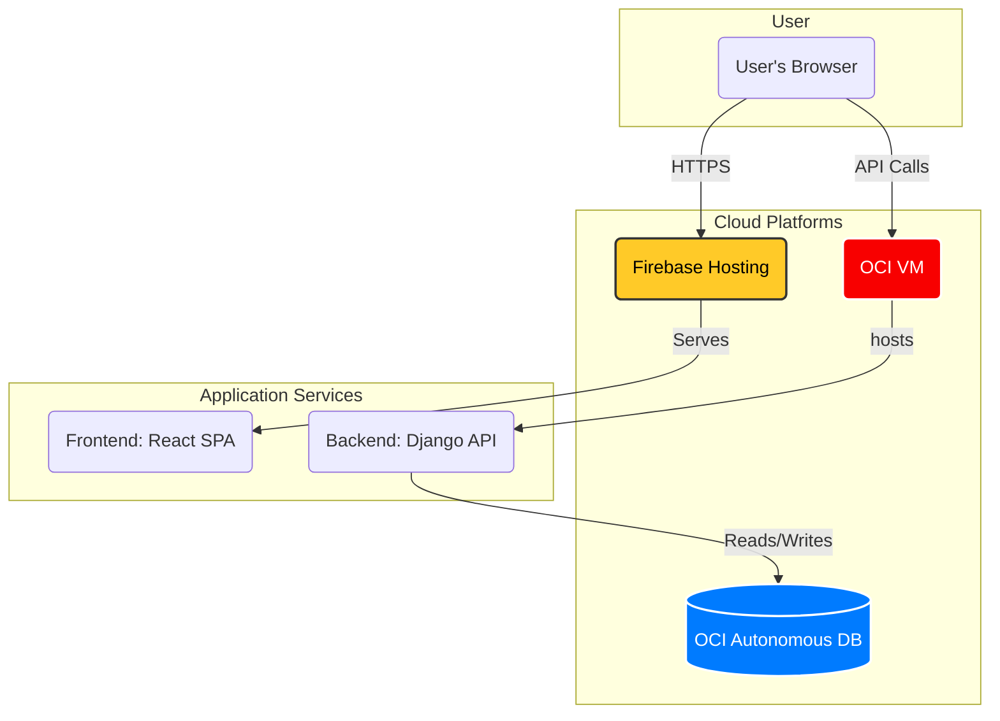

<div align="center">

# 🧠 GestãoRPD - Personal Development & Business Management Suite
### An integrated tool for cognitive self-improvement and simplified business operations.


</div>

---

## 🚀 Project Vision

**GestãoRPD** is a dual-purpose application designed to serve two distinct but complementary needs: **personal cognitive development** and **simplified business management**. It provides users with tools grounded in Cognitive Behavioral Therapy (CBT) while also offering a lightweight solution for managing small business operations.

The project demonstrates the ability to build a full-stack, multi-faceted application with a clear separation of concerns and a hybrid cloud deployment strategy.

---

## 🏛️ System Architecture

The application uses a decoupled architecture with a React frontend served by Firebase and a Django backend API containerized and deployed on Oracle Cloud Infrastructure (OCI).



---

## ✨ Key Features

-   ### Personal Development Module
    -   **Dysfunctional Thought Record (RPD/DTR):** A digital tool to help users identify, challenge, and reframe negative or automatic thoughts, a core technique in CBT.
    -   **Habit Tracker:** A module for creating, tracking, and analyzing personal habits to foster positive behavioral change.
    -   **Personal Dashboard:** A private space to view progress, insights, and historical data.

-   ### Business Management Module
    -   **Simple Sales Log:** A lightweight CRM to log sales, customer information, and transaction details.
    -   **Inventory Control:** Basic stock management to track product quantities and values.
    -   **Business Dashboard:** A summary of sales, revenue, and stock levels.

---

## ⚙️ Tech Stack

| Layer | Technology | Purpose |
| :--- | :--- | :--- |
| **Frontend** | React, Vite, `@cidqueiroz/cdkteck-ui` | A fast, modern, and responsive Single Page Application (SPA). |
| **Backend** | Django, Django Rest Framework | A secure and robust RESTful API for all application logic. |
| **Database** | Oracle Autonomous Database (on OCI) | Scalable and managed database for all user and business data. |
| **Deployment** | Docker, Firebase Hosting (Frontend), OCI (Backend) | Hybrid-cloud deployment strategy optimizing for cost and performance. |
| **DevOps** | GitHub Actions, Semantic Release | Fully automated CI/CD for releases and deployments. |

---

## 🛠️ Getting Started: Local Development

The application is fully containerized with Docker, providing a one-command setup for the local environment.

### Prerequisites
* Docker & Docker Compose
* Git

### 1. Clone the Repository
```bash
git clone https://github.com/CidQueiroz/GestaoRPD.git
cd GestaoRPD
```

### 2. Configure Environment Variables

Create an `.env` file in the root directory by copying `.env.example` if it exists.

**Key variables to set:**
-   `DATABASE_URL`: Your local or cloud database connection string for the backend.
-   `SECRET_KEY`: A Django secret key.
-   `NODE_AUTH_TOKEN`: Your GitHub PAT to install the private `@cidqueiroz/cdkteck-ui` package.

### 3. Build and Run the Application

This command will build and start the Django backend and React frontend services.

```bash
# Ensure NODE_AUTH_TOKEN is exported in your shell
export NODE_AUTH_TOKEN="YOUR_GITHUB_PAT_HERE"

# Build and start the containers
docker-compose up --build
```
-   **Backend API** will be available at `http://localhost:8000`.
-   **Frontend App** will be available at `http://localhost:5173`.

---

## 🚀 CI/CD Pipeline

The project features a sophisticated, dual-deployment CI/CD pipeline:

1.  **On Push to `main`:** A `release` workflow uses `semantic-release` to create a new version tag based on conventional commit messages.
2.  **On New Release (Backend):**
    -   A `deploy-production-oci` workflow is triggered.
    -   It connects to the OCI VM via SSH and runs `docker compose up --build` to deploy the new backend container.
3.  **On Push to `main` (Frontend):**
    -   A `deploy-production-firebase` workflow is triggered on changes to the frontend code (`src/**`, `index.html`, etc.).
    -   It installs dependencies (using `NODE_AUTH_TOKEN`), builds the React application, and deploys the static files to **Firebase Hosting**.
