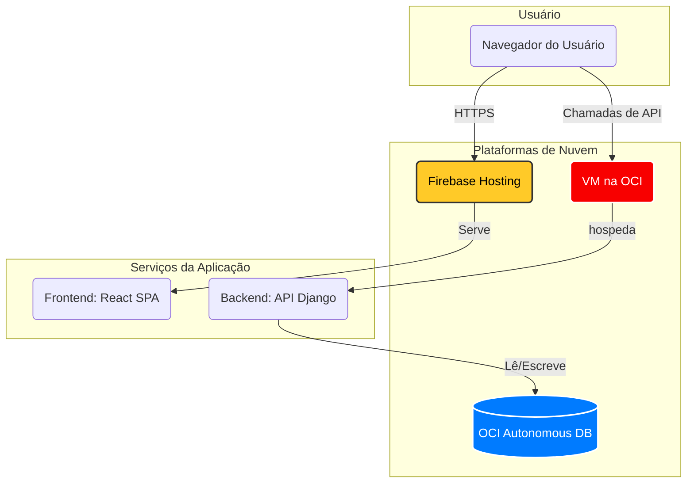

<div align="center">

# 🧠 GestãoRPD - Suíte de Desenvolvimento Pessoal e Gestão de Negócios
### Uma ferramenta integrada para autoaperfeiçoamento cognitivo e operações de negócios simplificadas.


</div>

---

## 🚀 Visão do Projeto

O **GestãoRPD** é uma aplicação de duplo propósito, projetada para atender a duas necessidades distintas, mas complementares: **desenvolvimento cognitivo pessoal** e **gestão de negócios simplificada**. Ele fornece aos usuários ferramentas baseadas na Terapia Cognitivo-Comportamental (TCC), ao mesmo tempo que oferece uma solução leve para gerenciar operações de pequenos negócios.

O projeto demonstra a capacidade de construir uma aplicação full-stack multifacetada com uma clara separação de responsabilidades e uma estratégia de implantação em nuvem híbrida.

---

## 🏛️ Arquitetura do Sistema

A aplicação utiliza uma arquitetura desacoplada com um frontend em React servido pelo Firebase e uma API de backend em Django containerizada e implantada na Oracle Cloud Infrastructure (OCI).



---

## ✨ Funcionalidades Chave

-   ### Módulo de Desenvolvimento Pessoal
    -   **Registro de Pensamentos Disfuncionais (RPD):** Uma ferramenta digital para ajudar os usuários a identificar, desafiar e reformular pensamentos negativos ou automáticos, uma técnica central da TCC.
    -   **Monitor de Hábitos:** Um módulo para criar, acompanhar e analisar hábitos pessoais para promover mudanças comportamentais positivas.
    -   **Dashboard Pessoal:** Um espaço privado para visualizar progresso, insights e dados históricos.

-   ### Módulo de Gestão de Negócios
    -   **Registro Simples de Vendas:** Um CRM leve para registrar vendas, informações de clientes e detalhes de transações.
    -   **Controle de Estoque:** Gerenciamento básico de estoque para acompanhar quantidades e valores de produtos.
    -   **Dashboard de Negócios:** Um resumo de vendas, receitas e níveis de estoque.

---

## ⚙️ Stack de Tecnologias

| Camada | Tecnologia | Propósito |
| :--- | :--- | :--- |
| **Frontend** | React, Vite, `@cidqueiroz/cdkteck-ui` | Uma Single Page Application (SPA) rápida, moderna e responsiva. |
| **Backend** | Django, Django Rest Framework | Uma API RESTful segura e robusta para toda a lógica da aplicação. |
| **Banco de Dados** | Oracle Autonomous Database (na OCI) | Banco de dados escalável e gerenciado para todos os dados de usuário e de negócio. |
| **Implantação** | Docker, Firebase Hosting (Frontend), OCI (Backend) | Estratégia de implantação em nuvem híbrida, otimizando custo e performance. |
| **DevOps** | GitHub Actions, Semantic Release | CI/CD totalmente automatizado para releases e implantações. |

---

## 🛠️ Começando: Desenvolvimento Local

A aplicação é totalmente containerizada com Docker, proporcionando uma configuração de ambiente local com um único comando.

### Pré-requisitos
* Docker & Docker Compose
* Git

### 1. Clone o Repositório
```bash
git clone https://github.com/CidQueiroz/GestaoRPD.git
cd GestaoRPD
```

### 2. Configure as Variáveis de Ambiente

Crie um arquivo `.env` na raiz do projeto, copiando o `.env.example` se ele existir.

**Principais variáveis a serem configuradas:**
-   `DATABASE_URL`: Sua string de conexão do banco de dados local ou na nuvem para o backend.
-   `SECRET_KEY`: Uma chave secreta para o Django.
-   `NODE_AUTH_TOKEN`: Seu PAT do GitHub para instalar o pacote privado `@cidqueiroz/cdkteck-ui`.

### 3. Construa e Execute a Aplicação

Este comando irá construir e iniciar os serviços do backend Django e do frontend React.

```bash
# Garanta que o NODE_AUTH_TOKEN está exportado no seu shell
export NODE_AUTH_TOKEN="SEU_PAT_DO_GITHUB_AQUI"

# Construa e inicie os containers
docker-compose up --build
```
-   **API do Backend** estará disponível em `http://localhost:8000`.
-   **Aplicação Frontend** estará disponível em `http://localhost:5173`.

---

## 🚀 Pipeline de CI/CD

O projeto possui um pipeline de CI/CD sofisticado e com implantação dupla:

1.  **No Push para a `main`:** Um workflow de `release` usa o `semantic-release` para criar uma nova tag de versão com base nas mensagens de commit convencionais.
2.  **Em um Novo Release (Backend):**
    -   Um workflow de `deploy-production-oci` é acionado.
    -   Ele se conecta à VM da OCI via SSH e executa `docker compose up --build` para implantar o novo container do backend.
3.  **No Push para a `main` (Frontend):**
    -   Um workflow de `deploy-production-firebase` é acionado em mudanças no código do frontend (`src/**`, `index.html`, etc.).
    -   Ele instala as dependências (usando `NODE_AUTH_TOKEN`), constrói a aplicação React e implanta os arquivos estáticos no **Firebase Hosting**.
